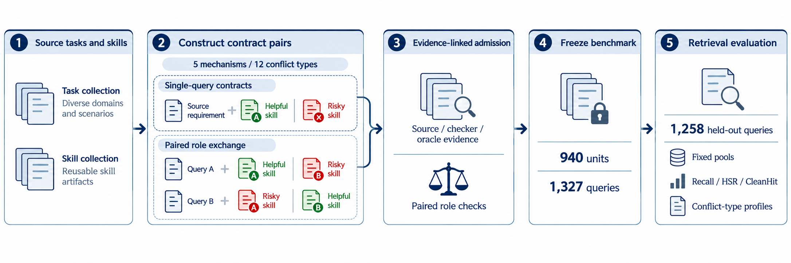

# SameCapRisk-Bench

SameCapRisk-Bench evaluates a specific failure in agent skill retrieval: a retriever finds the right capability family but exposes a representative whose resource, procedure, applicability, output, or evidence contract conflicts with the query.

Benchmark 1.0 contains **940 units and 1,327 query cases**, organized into five mechanisms and twelve conflict types. The main leaderboard uses **1,258 held-out queries** and reports Recall, marked-sibling exposure (HSR), and CleanHit together. Single-query public-pool and paired role-exchange results are always reported separately as well as in the fixed pooled protocol.



*SameCapRisk-Bench construction and evaluation pipeline. Source-bound and paired role-exchange units pass evidence-linked admission before frozen retrieval evaluation and joint Recall, HSR, and CleanHit reporting.*

## Start Here

| Goal | Entry point |
|---|---|
| Understand the benchmark | [Benchmark and metrics](docs/BENCHMARK.md) |
| Obtain the frozen files | [Access and release status](ACCESS_AND_RELEASE_STATUS.md) |
| Run a retrieval method | [Method integration](docs/METHOD_INTEGRATION.md) |
| Inspect current results | [Leaderboard](leaderboard/README.md) |
| Submit a method | [Method contribution](docs/METHOD_SUBMISSION.md) |
| Propose or dispute data | [Data contribution](docs/DATA_CONTRIBUTION.md) |
| Check source terms | [Source and licenses](docs/SOURCE_AND_LICENSES.md) |

## Five-Minute Interface Check

The repository includes a synthetic fixture; it does not require benchmark labels or third-party text.

```bash
python -m pytest -q
```

With the Benchmark 1.0 artifact extracted beside this repository:

```bash
python scripts/run_method_adapter.py \
  --inference ../samecaprisk_bench_v1.0/benchmark/inference \
  --adapter scripts/method_adapter_example.py \
  --method-id my_method \
  --out runs/my_method/top20.tsv

python scripts/evaluate_frozen_rankings.py \
  --inputs ../samecaprisk_bench_v1.0/benchmark \
  --ranks runs/my_method/top20.tsv \
  --out runs/my_method/metrics.json
```

See the integration guide before running a publishable experiment. The two candidate pools must never be concatenated, and public text-only methods must not read labels, families, taxonomy, evidence, or split metadata during inference.


## How a Result Enters the Leaderboard

Method contributions follow one auditable path:

1. **Self-reported:** submit a method card, complete top-20 ranks, metrics, and code/configuration provenance.
2. **Format-checked:** automated checks validate query coverage, pool membership, unique consecutive ranks, finite scores, and file hashes.
3. **Metric-recomputed:** maintainers recompute all fixed scopes from the submitted ranks.
4. **Setting-verified:** maintainers inspect code and configuration to confirm the declared information setting and development-data use.
5. **Accepted:** the result is added to the matching setting table with immutable rank and code hashes.

Run the same automated gate locally:

```bash
python scripts/validate_method_submission.py \
  --artifact ../samecaprisk_bench_v1.0 \
  --submission runs/my_method \
  --out runs/my_method/validation_receipt.json
```

Results are compared only within the same information setting. The leaderboard never mixes public text-only retrieval, public text clustering, released-family controls, and benchmark-trained diagnostics into a single rank.

## Ways to Participate

- **Evaluate a method:** use the label-free inference files, generate ranks, and submit the reproducibility bundle described above.
- **Propose data or validation evidence:** supply source-bound query and sibling spans, the claimed conflict type, and version-bound evidence. Accepted additions enter a future benchmark version; v1.0 remains immutable.
- **Report a label or source issue:** identify the exact unit, source revision, disputed span, and evidence. Corrections are reviewed under the same admission rules and recorded in the version history.

See [method submission](docs/METHOD_SUBMISSION.md), [data contribution](docs/DATA_CONTRIBUTION.md), and the issue templates for exact requirements.

## Project Model

The GitHub repository is the project homepage. It carries documentation, schemas, evaluation code, result tables, issue templates, and contribution history. Versioned data and fixed ranks are distributed as release assets so that large immutable files do not accumulate in Git history. A separate website is unnecessary for the first release; GitHub Pages can later render the same leaderboard files if the number of submissions warrants it.

This repository is a **pre-release project surface**. The benchmark research snapshot is frozen, while anonymous access and unrestricted public redistribution remain separate gates. The full benchmark bundle is not placed on `main` until those gates pass; see [ACCESS_AND_RELEASE_STATUS.md](ACCESS_AND_RELEASE_STATUS.md).
